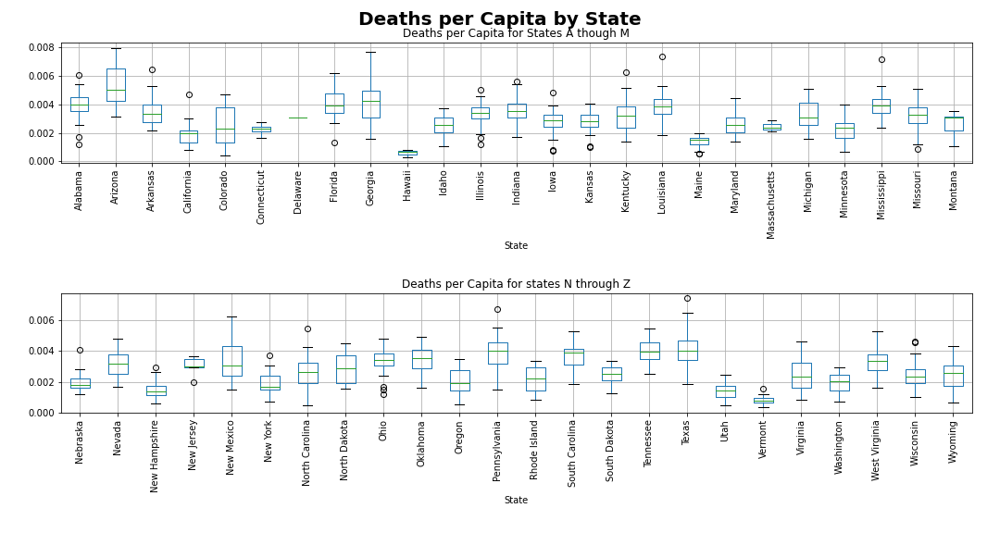

# Summary of Findings

**1. What region of the country has the highest rate of covid cases, covid deaths and heart disease?**
- The heatmap below is created based on Heart Disease, with a max intensity of 600 out of 100,000 population (0.6% of the population). The red pins show the top 5 places with COVID Cases per Capita and the black dots show the top 5 COVID places with deaths per capita. As seen in the map, east coast states had higher previous heart disease problems prior to the pandemic, and thus higher number of COVID cases and covid deaths in 2020-2022 (a limitation of data points in states in the Midwest might be affecting the results). 

- In the boxplots below, we see the distribution of COVID deaths and COVID cases among states during the pandemic. This also shows how east coast states (e.g. Alabama, Arkansas, Florida, Georgia, Kentucky, Mississippi, North Carolina, Pennsylvania, South Carolina) have higher average deaths per capita than Midwest states (e.g. Minnesota, Missouri, Nebraska, North Dakota, Utah, Wyoming)

**2. How did covid cases and covid deaths progressed over time?**
- COVID cases first lightly spiked in Apr 2020 and spiked again in Feb 2021. COVID deaths spiked in Apr 2020 and increased slightly since then. This suggests that the proportion of COVID deaths to COVID cases has decreased over time. One possible explanation is the introduction of the vaccine early 2021. 

**3. How does political affiliation affect vaccination, covid deaths, and heart disease?**
- There are significant differences in terms of vaccination, death rates, income and heart disease between counties that overall voted Republican in the 2016 Presidential Election and those that voted Democrat.
- As seen in the histogram below, Republican counties have significantly lower vaccination rates and higher COVID death rates than the Democratic counties. In the boxplots below, we can also see that Republican counties have higher rates of heart disease and lower income.

**4. What is the correlation between Median Income, Vaccination Rates and Covid Deaths?**
- In the boxplot below, we can see that a counties median income is not correlated with the number of COVID cases (0.23 cases per capita, independently of the median income.

- Nevertheless, as observed in the leftmost boxplot, states with high incomes had lower rates of death by covid. Those whose median income range greater than 70K annually had 0.002 deaths per capita compared with 0.0035 for those counties with median income range below 50K.

**5. How did heart disease rates in the years previous to COVID  affect the number of covid deaths in 2020?**
- When accounting for income, high rates of heart disease made you significantly more likely to have an abnormally high rate of death. Of outliers that were higher than our IQR for deaths per capita nearly 50% had rates of heart disease that were high outliers as well when compared to the national average (greater than upper IQR). Nothing this drastic was observed for outliers in other regards.

<table border="1" class="dataframe">
  <thead>
    <tr style="text-align: right;">
      <th></th>
      <th>Vaccination Rate</th>
      <th>Household Income</th>
      <th>Heart Disease</th>
      <th>Stroke</th>
      <th>County</th>
      <th>State</th>
      <th>Deaths per Capita</th>
      <th>Median Income Range</th>
    </tr>
  </thead>
  <tbody>
    <tr>
      <th>36</th>
      <td>93.6</td>
      <td>32963.0</td>
      <td>271.2</td>
      <td>72.2</td>
      <td>Apache</td>
      <td>Arizona</td>
      <td>0.007956</td>
      <td>&lt;$50,000</td>
    </tr>
    <tr>
      <th>369</th>
      <td>34.5</td>
      <td>35757.0</td>
      <td>375.4</td>
      <td>87.0</td>
      <td>Dodge</td>
      <td>Georgia</td>
      <td>0.006597</td>
      <td>&lt;$50,000</td>
    </tr>
    <tr>
      <th>408</th>
      <td>39.1</td>
      <td>34946.0</td>
      <td>557.1</td>
      <td>91.3</td>
      <td>Emanuel</td>
      <td>Georgia</td>
      <td>0.006489</td>
      <td>&lt;$50,000</td>
    </tr>
    <tr>
      <th>447</th>
      <td>36.0</td>
      <td>35466.0</td>
      <td>810.5</td>
      <td>65.7</td>
      <td>Franklin</td>
      <td>Louisiana</td>
      <td>0.007381</td>
      <td>&lt;$50,000</td>
    </tr>
    <tr>
      <th>852</th>
      <td>86.0</td>
      <td>38035.0</td>
      <td>289.0</td>
      <td>73.5</td>
      <td>Maverick</td>
      <td>Texas</td>
      <td>0.007383</td>
      <td>&lt;$50,000</td>
    </tr>
    <tr>
      <th>937</th>
      <td>72.0</td>
      <td>40054.0</td>
      <td>270.5</td>
      <td>73.6</td>
      <td>Navajo</td>
      <td>Arizona</td>
      <td>0.007387</td>
      <td>&lt;$50,000</td>
    </tr>
    <tr>
      <th>940</th>
      <td>39.9</td>
      <td>36875.0</td>
      <td>708.4</td>
      <td>101.8</td>
      <td>Neshoba</td>
      <td>Mississippi</td>
      <td>0.007183</td>
      <td>&lt;$50,000</td>
    </tr>
    <tr>
      <th>1281</th>
      <td>41.1</td>
      <td>36575.0</td>
      <td>438.3</td>
      <td>91.7</td>
      <td>Toombs</td>
      <td>Georgia</td>
      <td>0.006581</td>
      <td>&lt;$50,000</td>
    </tr>
    <tr>
      <th>1304</th>
      <td>44.5</td>
      <td>36529.0</td>
      <td>507.9</td>
      <td>160.9</td>
      <td>Upson</td>
      <td>Georgia</td>
      <td>0.007705</td>
      <td>&lt;$50,000</td>
    </tr>
    <tr>
      <th>1337</th>
      <td>37.4</td>
      <td>39887.0</td>
      <td>473.1</td>
      <td>95.2</td>
      <td>Ware</td>
      <td>Georgia</td>
      <td>0.007107</td>
      <td>&lt;$50,000</td>
    </tr>
  </tbody>
</table>

